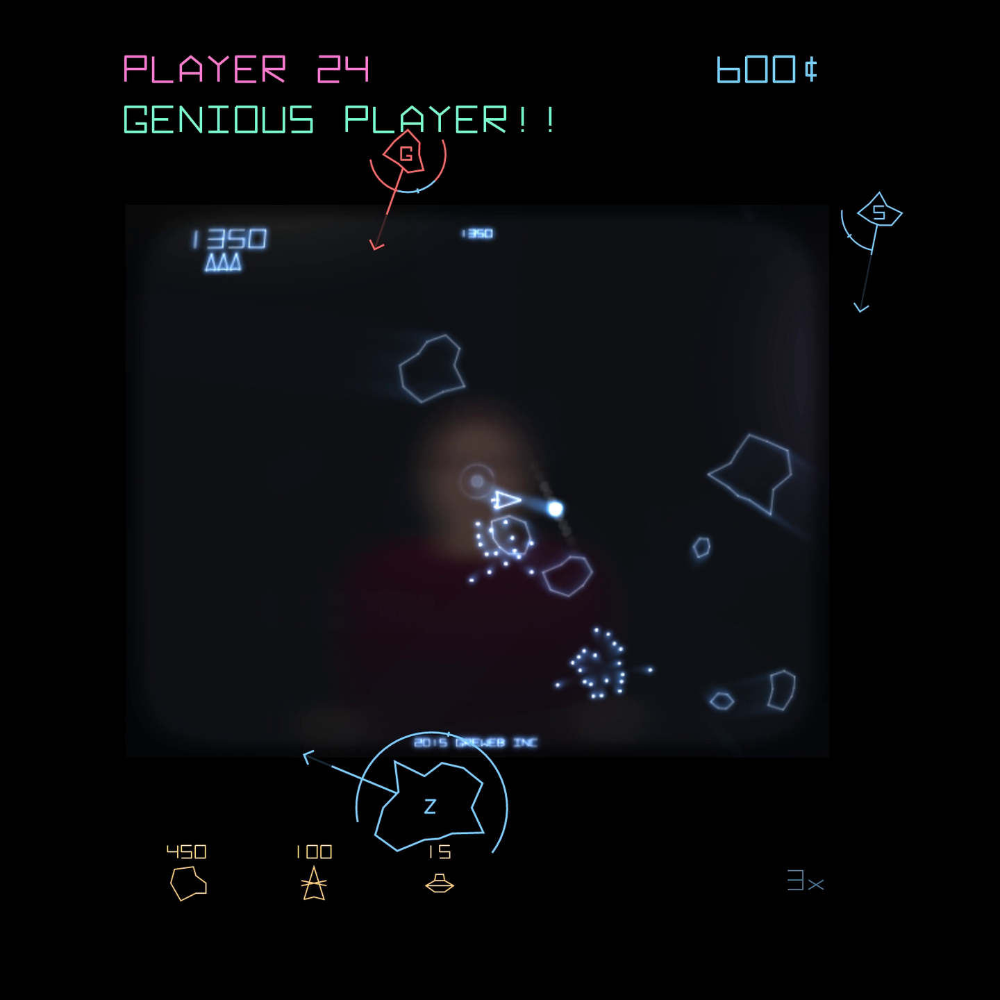
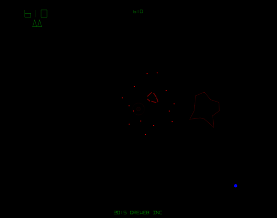
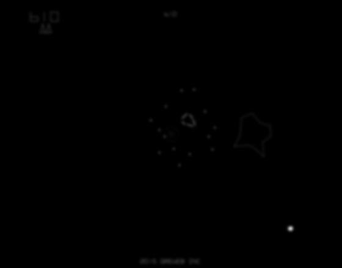
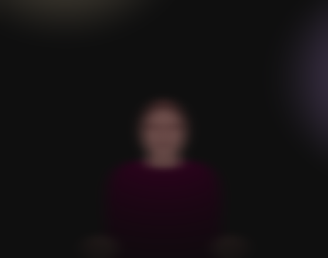
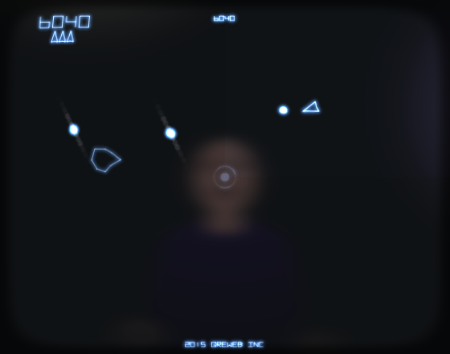
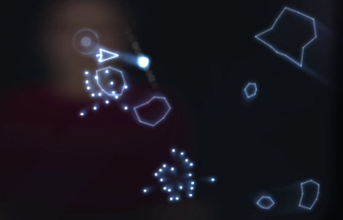
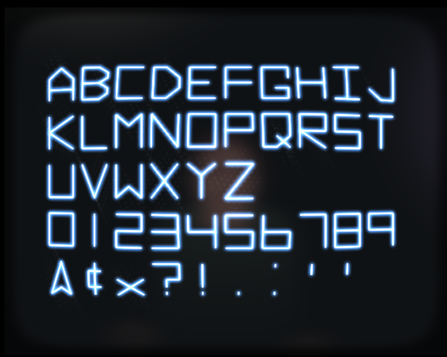

# Behind Asteroids, The Dark Side
[](http://js13kgames.com/) [](http://2015.js13kgames.com/#winners)  [](http://2015.js13kgames.com/#winners-mobile)  [](http://2015.js13kgames.com/#winners-community)

[PLAY](http://js13kgames.com/games/behind-asteroids-the-dark-side/index.html) – [entry](http://js13kgames.com/entries/behind-asteroids-the-dark-side)

## Synopsis

Ever wondered what is happening under the hood of an Asteroids Arcade machine?
I can tell you: A greedy evil 25¢ money maker engine.

## Context

This is an entry for [js13kGames](http://js13kgames.com/entries/2015), goal is to make a web game in less than 13k zipped of JavaScript.
Theme was **"Reversed"**.

### Inspiration

- The Asteroids original Arcade machine [I've discovered in Brooklyn's Barcade](https://twitter.com/greweb/status/631981745638875137).
- Youtube videos like [this one](https://www.youtube.com/watch?v=w60sfReTsRA).

**Best quote ever**
> ["Not bad for a 35 years old system. 35 years old. Things don't get better than this. They don't get better than this. Look at this picture, you know what, even HD can't be this clear, crystal clear, razor sharp, wonderful vector graphics. Sorry there is nothing like it. *nothing like it*. What a terrific game."](https://youtu.be/i-x_gPxqEMw?t=4m14s)

### Special thanks

- [mrspeaker](http://twitter.com/mrspeaker) for his support, testing and English help.

## Game versions

The game both works for mobile and desktop but the gameplay varies.
The desktop version is a [touch typing](https://en.wikipedia.org/wiki/Touch_typing) game
where the mobile version is a simple touch game. If you are not good at typing on keyboards,
just prefer the mobile version.

On mobile (especially for iOS Safari), please use **Add to Home screen** for better experience.

---

# The Game

Behind Asteroids is a game about throwing asteroids to people playing "Asteroids"
on an arcade machine. Like in Asteroids game, player have 3 extra lifes.
The goal is to make the player lose and try to earn as much coins as possible.
When a player lose, another come and put a new coin in the arcade.


There are different game mechanism involved, they get introduced in first levels
and get harder and harder to use:

- The Asteroids have an aiming centered in the spaceship that varies the throw velocity
- The Asteroids aiming rotates (Player >2)
- The "RED" area in the aiming that make you fail the throw (Player >3)
- The UFO bonus that you get after sending asteroids without failing to throw an asteroid (Player >4)





## Game Over

Everytime the player is reaching 10'000 points, he wins a new extra life,
You lose if player reaches 5 lifes.


## Continue

Game is saved every time a player entered and can be continued later.


---

# Tech overview

- Canvas2D for the game primitives drawing
- [WebGL](src/lib/webgl.js) for post processing effects (7 fragment shaders)
- [Web Audio API](src/lib/audio.js) + [jsfxr](src/lib/jsfxr.js) ([14 sounds](src/sounds.js))
- [Asteroid fonts implemented "by hand"](src/lib/asteroids.font.js)
- *... (more to describe later)*

## Making of the post-processing effects pipeline

> Here is an non exhaustive summary of what's going on with the WebGL post-processing effects.

Because this is a 2D game, a subset of WebGL is used here: we just use 2 triangles that cover the whole surface in order to just focus in writing fragment shaders.

### primitives are down on a simple [2D Canvas](http://www.w3.org/TR/2dcontext/)
with classical Canvas 2D code but also
using the 3 color channels (RED, GREEN, BLUE) independently to split objects into different classes...



### A [laser shader](src/shaders/laser.frag) draws it to monochrome

It sums up the 3 color channels. The **BLUE** channel, used for the bullets, gets accentuated in a factor that depends on the screen position. This intends to recreate the various intensity of a vector monitor.

The result of this shader is also blurred:



### the [player shader](src/shaders/player.frag) is rendered
The player and it environment (that will be reflected in the screen) is procedurally generated in a shader.

The shader code is a bit crazy right now probably because of all animations, but the drawing is not so complex: this is just about drawing ovale and [squircle]() shapes and also some gradients for the lightning.


We don't directly use this image in the game, it is visually not very realist, but if we **blur it a lot (and even more on X axis)** to recreate a reflection style, it becomes quite interesting:



The objective is to find an equilibrium between seeing it a bit in background but not too much. Also note that the hands are moving during a game, this is very subtile to see but it is part of the environment.

### a [Glare shader](src/shaders/glare.frag) effects is added

Glare is obtained by applying a large directional blur.
It is only applied on bright objects (basically just bullets).




### Result with some [persistence](src/shaders/persistence.frag)



The final [Game shader](src/shaders/game.frag) combines 5 textures:

```glsl
uniform sampler2D G; // game
uniform sampler2D R; // persistence
uniform sampler2D B; // blur
uniform sampler2D L; // glare
uniform sampler2D E; // env (player)
```

The blur texture is used as a way to make the glowing effect (multiplying with a blue color).
The persistence texture stores the previous blur texture to accumulate motion blur over time.

### Finally, we just put the UI canvas on top of the game canvas


## Font drawing



[Code is here](src/lib/asteroids.font.js)

## Feedbacks on developing a JS13K game

### Don't start with JS*K tricks

My first point is about NOT doing any JavaScript tricks to save more bytes until you are at the last days of the competitions and if it happens you actually are >13k (really, 13K zipped is plenty of room for making a game even if not "bytes optimized").

So, you want your game to run first.
And even if you have a first version, you might improve it, so keeping your code readable and maintainable is very important.

### Don't fear beginning with libraries!

Unlike some recommendations I've seen previously about making JS13K games,
I think you can afford starting with some libraries.
Just keep in mind to not be too much tied to these libraries so you can eventually remove them.

My point is, the process of making a game is very long and you want to be
as productive as possible to prototype and add game features.

In my game I've used [stack.gl](http://stack.gl) libraries for making the post processing effects, and I only port my code back to raw WebGL when I was really sure it was done.
I was very productive working on these effects and was not stuck by crazy code.

When I was sure of the post-processing pipeline, I've then replaced usage of these libraries by [tiny utility functions](src/lib/webgl.js) specific for my needs.

## Make your game visually debuggable

When developing a game, especially an AI, it is important to debug.
And by debug I mean displaying hidden game logic.
The problem of `console.log`ging things is it is difficult to picture it with the game for a given instant.

You want to see vectors and AI decisions to be able to tweak game parameters and improve the game.

[See in this video one display I've used when debugging the AI](https://www.youtube.com/watch?v=1F5XWY4fGaY)

## I have avoided "OO-style" to functional style

There is no "Objects" in my game, I've gone away from the classical prototype / OO way of doing games.

What I've used is just arrays. This is both a technical choice (going more FP) and a way to save more bytes (a minifier can't rename fields of objects, `[0], [1], ...` are obviously saving bytes especially when zipped).

### Array as data structure

So instead of objects, I've used array like a tuple.
For instance, the `spaceship` state is `[x, y, velx, vely, rot]`
and `asteroids` state is an array of `[x, y, rot, vel, shape, lvl]`.

All my game state is in [state.js](src/state.js) and "tuple types" are all documented.

Taking this approach, you better have to design your game state first so you don't change this over time (this is the cons of this approach, indexes are not really readable and maintainable).

Also you should try to make your tuple looking like the same so you can share some code for different types (`x, y` is always the 2 first values in my tuples).

### Embrace Functions

Instead of object methods, I just have a lot of functions.
For instance, I have `drawAsteroid(asteroid)`.

Some functions are generic so you can re-use them for different needs.
I've found a very nice way of implementing **"behaviors"** of objects:

```js
// code from the update loop
euclidPhysics(spaceship);
asteroids.forEach(polarPhysics);
ufos.forEach(euclidPhysics);
bullets.forEach(euclidPhysics);
particles.forEach(polarPhysics);

ufos.forEach(applyUFOlogic);
incomingObjects.forEach(applyIncLogic);

particles.forEach(applyLife);
loopOutOfBox(spaceship);
asteroids.forEach(
  // conditional behavior !!
  playingSince > 0 && !awaitingContinue && !gameOver ?
  destroyOutOfBox : loopOutOfBox);
ufos.forEach(loopOutOfBox);
bullets.forEach(applyLife);
bullets.forEach(loopOutOfBox);
```

Also, it is easy to pass function as a value:
```js
// code from the render loop
renderCollection(asteroids, drawAsteroid);
renderCollection(ufos, drawUFO);
renderCollection(bullets, drawBullet);
renderCollection(particles, drawParticle);
```

## Build system

The build system is dedicated to JS13K and made with a few simple [scripts](package.json).
It is able to copy assets, [concat all files](scripts/concat.sh), [minify the GLSL code](scripts/compileglslfiles.sh), minify the JavaScript, zip the result and give size information.

Things are a bit specific to my need but remain very simple, modular and powerful, you could easily fork it.

### dev

```
npm run liveserver
```

```
npm run watch
```

### prod

```
npm run build
```
